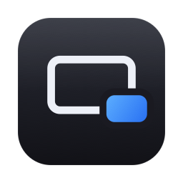

<div align="center">



# Glance

**Universal Picture-in-Picture for macOS, built natively with Swift.**

Pin any region of any window to a floating always-on-top panel.
No browser, no extension, no Electron.

</div>

---

## What it does

Drag a box over anything on screen — a video, a build log, a chart, a video call —
and Glance pins it to a small floating panel that stays above every other window
and follows you across Spaces.

The panel tracks the **source window**, not the screen. Move Safari to the other
side of the display and the PiP keeps showing the same part of Safari, not
whatever is now sitting in those coordinates.

## Features

| | |
|---|---|
| **Region capture** | Drag any rectangle, on any display, in any app. |
| **Window-relative tracking** | The crop is anchored to the source window and follows it when moved. Falls back to display capture for desktop selections. |
| **Ghost Mode** | Dim the panel to 55% and let every click pass through to the app behind it. Toggle with `⌥G`. |
| **Corner snapping** | Release a drag and the panel springs to the nearest corner with an analytically-solved spring (`response 0.3`, `damping 0.6`). |
| **Aspect-locked resize** | Drag any corner; the panel is constrained to the capture's exact ratio, so the video always fills it. |
| **Zero-copy rendering** | Frames go straight from the WindowServer's `IOSurface` to a `CALayer`. No texture upload, no colour conversion, no CPU copy. |
| **Menu bar only** | `LSUIElement` agent. No Dock icon, no window clutter. |

## Shortcuts

| Action | Default |
|---|---|
| New capture | `⌥⇧G` |
| Toggle Ghost Mode | `⌥G` |

Both are global and rebindable from **Settings → Shortcuts & Onboarding…**.

Ghost Mode makes the panel ignore the mouse entirely, so the hotkey is the
guaranteed way back out. There is also a corner exit badge — the one region of
the panel that stays clickable while ghosting — and a menu bar item.

## Requirements

- macOS 14 (Sonoma) or later
- Screen Recording permission
- Xcode 15+ and [XcodeGen](https://github.com/yonaskolb/XcodeGen) to build

## Build

```bash
brew install xcodegen
./build_and_run.sh          # generate, build, verify signature, launch
./build_and_run.sh --logs   # ...and stream the app's OSLog output
```

The script builds a Release bundle into `Build/`, verifies the code signature,
and launches the `.app`.

### On code signing

Glance must be signed with a **stable** identity, and `build_and_run.sh`
deliberately does not re-sign the bundle after Xcode has.

macOS keys the Screen Recording grant to the app's *designated requirement*. An
ad-hoc signature (`codesign --sign -`) has no team identifier, so TCC falls back
to pinning the grant to the **cdhash** — which changes on every single build,
silently revoking Screen Recording each time you rebuild. Set
`CODE_SIGN_IDENTITY` in `project.yml` to a real development certificate.

## Architecture

```
SelectionOverlayView ──▶ SelectionCoordinator ──▶ GlanceCoordinator
   (drag a rect)            (one overlay/screen)     (owns all state)
                                                            │
                                                            ▼
                                                     CaptureEngine
                                                            │
                              SCContentFilter(desktopIndependentWindow:)
                                   ── or, for desktop selections ──
                              SCContentFilter(display:excludingWindows:)
                                                            │
                                              IOSurface (zero-copy, XPC)
                                                            ▼
                                    VideoLayerView  →  layer.contents
                                                            ▼
                                                       GlancePanel
                                              (borderless floating NSPanel)
```

| File | Role |
|---|---|
| `Capture/CaptureEngine.swift` | `SCStream` lifecycle, target resolution, coordinate conversion, frame delivery |
| `Capture/ScreenPicker.swift` | `NSScreen` ↔ `SCDisplay` bridging, window hit-testing |
| `PiP/GlanceWindowController.swift` | The floating panel, drag/snap/resize, Ghost Mode |
| `PiP/VideoLayerView.swift` | `IOSurface` → `CALayer` presentation |
| `Selection/` | The screenshot-style region picker |
| `Onboarding/` | First-run splash: permission, launch at login, shortcuts |
| `Utilities/SnapEngine.swift` | Corner anchors + analytical spring solver |
| `Utilities/Log.swift` | OSLog channels + uncaught-exception diagnostics |
| `Tools/make-icon.swift` | Renders the app icon with Core Graphics |

### Coordinate spaces

Three of them, and mixing them up is the source of most capture bugs:

- **Cocoa global** — bottom-left origin, relative to the primary display. What
  `NSScreen` and `NSWindow` use. The selection overlay reports in this space.
- **Core Graphics global** — top-left origin. What `SCWindow.frame` and
  `CGWindowListCopyWindowInfo` use.
- **Filter content rect** — what `SCStreamConfiguration.sourceRect` is measured
  against. For a window filter this is *not* the window's global frame.

`sourceRect` is in **points**; `config.width`/`height` are in **backing pixels**
(points × `filter.pointPixelScale`). `destinationRect` is in output-surface
pixels and is intentionally left unset.

## Debugging

```bash
log stream --style compact --level debug \
  --predicate 'subsystem == "com.filippocappa.glance"'
```

Channels: `permissions`, `capture`, `render`, `window`, `selection`.
Uncaught exceptions are logged to the `window` channel with a stack trace, since
AppKit swallows some resize-time exceptions without writing a crash report.

## Dependencies

- [LaunchAtLogin-Modern](https://github.com/sindresorhus/LaunchAtLogin-Modern) — `SMAppService` login item
- [KeyboardShortcuts](https://github.com/sindresorhus/KeyboardShortcuts) — global hotkeys + recorder UI

Both by [Sindre Sorhus](https://github.com/sindresorhus), via SPM.

## Icon

Generated, not drawn:

```bash
swift Tools/make-icon.swift
```

Renders all ten catalog sizes plus `Tools/Glance.icns` with Core Graphics.

## License

MIT
